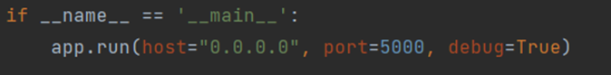

# 1. Giới thiệu
Phát triển ứng dụng hỗ trợ người khiếm thị đọc sách. Ứng dụng sử dụng chú thích hình ảnh và công nghệ OCR để chuyển đổi hình ảnh của văn bản thành lời nói. Người dùng có thể chỉ cần chụp ảnh văn bản bằng camera trên điện thoại thông minh của mình và ứng dụng sẽ xử lý văn bản bằng Flask API được tích hợp với OpenCV để xử lý hình ảnh và OCR. Sau đó, văn bản được chuyển đổi sẽ được phát âm bằng chức năng Chuyển văn bản thành giọng nói (TTS).

- [1. Giới thiệu](#1-giới-thiệu)
- [2. Phương pháp thiết kế](#2-phương-pháp-thiết-kế)
  - [2.1. Ở phía người dùng:](#21-ở-phía-người-dùng)
  - [2.2. Ở máy chủ API:](#22-ở-máy-chủ-api)
  - [2.3. Quay lại phía người dùng:](#23-quay-lại-phía-người-dùng)
- [3. Cấu trúc hệ thống](#3-cấu-trúc-hệ-thống)
  - [3.1. Phần cứng:](#31-phần-cứng)
  - [3.2. Phần mềm:](#32-phần-mềm)
- [4. Huấn luyện mô hình Image Caption](#4-huấn-luyện-mô-hình-image-caption)
  - [4.1. Huấn luyện:](#41-huấn-luyện)
  - [4.2. Đánh giá mô hình](#42-đánh-giá-mô-hình)
- [5. Triển khai máy chủ API](#5-triển-khai-máy-chủ-api)
  - [5.1. Tổng quan:](#51-tổng-quan)
  - [5.2. 	Cấu hình Flask:](#52-cấu-hình-flask)
- [6. Xây dựng ứng dụng trên Android Studio](#6-xây-dựng-ứng-dụng-trên-android-studio)
  - [6.1. Giao diện ứng dụng](#61-giao-diện-ứng-dụng)
  - [6.2. Các quyền truy cập vào phần cứng thiết bị](#62-các-quyền-truy-cập-vào-phần-cứng-thiết-bị)
  - [6. Phản hồi và chuyển văn bản thành giọng nói](#6-phản-hồi-và-chuyển-văn-bản-thành-giọng-nói)
  - [6.3. Mô hình kết nối mạng](#63-mô-hình-kết-nối-mạng)
- [7. Demo](#7-demo)
  - [7.1. Giao diện app](#71-giao-diện-app)
- [8. Kết quả, đánh giá](#8-kết-quả-đánh-giá)
  - [8.1. Kết quả](#81-kết-quả)
  - [8.2. Đánh giá](#82-đánh-giá)


# 2. Phương pháp thiết kế
Thiết kế và triển khai hệ thống phát giọng nói được sử dụng để giúp đỡ người khiếm thị đọc sách. Hệ thống được đặc trưng bởi nhiều thuật toán, chia nhiều thành phần để có hiệu quả và dễ sử dụng. Hệ thống sử dụng một máy chủ làm API riêng và dùng thiết bị có thể chụp ảnh làm phía người dùng.


## 2.1. Ở phía người dùng:
-	Bước 1: Thực hiện chụp ảnh, dùng điện thoại thông minh có camera làm thiết bị đầu vào cho hệ thống, chụp ảnh trang sách bằng điện thoại. Hình ảnh phải có độ phân giải cao và chứa vùng nội dung trang sách muốn đọc.
-	Bước 2: Ảnh sẽ được mã hoá thành chuỗi nhị phân và gửi đến máy chủ API.
## 2.2. Ở máy chủ API:
-	Bước 1: Nhận được hình được gửi từ người dùng gửi đến API. API được tạo bằng thư viện Flask.
-	Bước 2:
Hình ảnh nhận được đã được mã hoá, thực hiện giải mã để thu được hình ảnh. Vì là người khiếm thị nên hình ảnh được chụp không chỉ chứa trang sách đơn thuần nên cần áp dụng cách thuật toán phát hiện để xác định hình ảnh trang sách.
Dùng thuật toán tìm kiếm cạnh Candy Edge Detection phát hiện các đường viền. Chúng ta sẽ duyệt qua các đường viền được tìm thấy và xấp xỉ các đường viền đó thành đa giác gần đúng. Nếu đa giác có đủ 4 cạnh ta ta sẽ xác định 4 điểm góc, các điểm góc được sử dụng để thu được ảnh trang sách trên ảnh gốc.
-	Bước 3:
Nếu không tìm thấy trang sách phù hợp, thông báo và kết thúc chương trình.
Trường hợp tìm thấy trang sách, trang sách có thể chỉ chứa văn bản hoặc vừa hình ảnh vừa văn bản. Tiếp tục áp dụng các thuật toán tìm kiếm đường viền để thu được các hình thuộc trang sách.
Dùng mô hình sinh mô tả ảnh đã huấn luyện để sinh mô tả lần lượt các hình ảnh trong tệp tìm được. Ta có được vị trí các vùng hình ảnh nên sẽ chuyển các hình thành nền trắng và ghi đè nội dung mô tả lên vùng được xử lý đó và lưu thành một hình ảnh mới.
-	Bước 4:
  Nhận dạng văn bản, thuật toán Teasseract OCR sẽ được áp dụng để chuyển hình ảnh văn bản thành các ký tự.
  Teasseract OCR là một công cụ OCR phổ biến hiện nay. Văn bản sau khi được phát hiện sẽ thực hiện sữa lỗi, làm sạch các ký tự đặc biệt,… để tăng độ chính xác của văn bản.
-	Bước 5: Gửi văn bản hoàn chỉnh về phía người dùng.
## 2.3. Quay lại phía người dùng:
-	Bước 1: Nhận văn bản từ API gửi về.
-	Bước 2: Sử dụng các công cụ chuyển văn bản thành giọng nói và phát thành âm thanh bằng loa.

# 3. Cấu trúc hệ thống


Kiến trúc tổng quan của hệ thống đọc sách cho người khiếm thị, người mù và chỉ phát âm thanh tập trung vào cung cấp trải nghiệm đọc sách toàn diện bằng âm thanh. Hệ thống này bao gồm hai thành phần chính:
## 3.1. Phần cứng:
- Bộ điều khiển: Bao gồm một bộ điều khiển hoạt động bằng cảm ứng hoặc các nút điều khiển vật lý để người dùng có thể tương tác với hệ thống.
- Loa: Được sử dụng để phát lại âm thanh, truyền tải nội dung sách đến người dùng.
## 3.2. Phần mềm:
-	Ứng dụng đọc sách: Đây là phần mềm chạy trên hệ điều hành của hệ thống (ví dụ: Android) và có khả năng chuyển đổi văn bản thành giọng nói.
-	Tổng hợp giọng nói: Sử dụng các công nghệ tổng hợp giọng nói để chuyển đổi văn bản thành âm thanh và phát lại cho người dùng.

# 4. Huấn luyện mô hình Image Caption


Việc phát triển mô hình có các khối sau:
-	Xử lý ảnh, trích xuất đặc trưng của ảnh.
-	Bộ tiền xử lý văn bản.
-	Dự đoán đầu ra.
-	Lắp mô hình.
-	Chú thích Geneartion.

## 4.1. Huấn luyện:
```
model.optimizer.learning_rate.assign(0.0001)
	generator = data_generator(train, mapping, features, wordtoix, max_length, batch_size)
	model.fit(generator, epochs=epochs, steps_per_epoch=steps, verbose=1)
	model.save('output_glove/model_' + str(i) + '.h5')
```


Một số hình ảnh được mô tả qua mô hình được huấn luyện:

|  STT | Ảnh  |
|---|---|
|1||
|2||
|3||

## 4.2. Đánh giá mô hình
```
image_ids = list(mapping.keys())
train = image_ids[:106155]
test = image_ids[106155:]
```
Ở mô hình này, chia bộ dữ liệu thành 2 phần gồm phần huấn luyện (train) và kiểm tra (test) để đánh giá chất lượng của mô hình.
Dùng sentence_bleu trong thư viện nltk để tính điểm BLEU. Thực hiện so sánh các mô tả được tạo ra bởi mô hình với các mô tả thực tế để đánh giá mức độ trùng lặp


Kết quả: 0.647 nằm trong khoảng từ 0.5 đến 0.75: cho thấy hệ thống mô hình sinh mô tả được huấn luyện hoạt động tốt.

# 5. Triển khai máy chủ API
## 5.1. Tổng quan:


Khi có yêu cầu POST từ Client, chương trình sẽ thực hiện việc tìm kiếm trang sách:
-	Trường hợp có trang sách hợp lệ thực hiện sinh mô tả và nhận dạng văn bản.
-	Trường hợp không có trang sách hợp lệ, đưa ra một thông báo kết quả “Không có trang sách hợp lệ”.
## 5.2. 	Cấu hình Flask:
Tạo Handle '/image_ocr' route: Đây là xử lý cho yêu cầu tới đường dẫn '/image_ocr'. Trong bước này, xây dựng chương trình cho yêu cầu POST, tạo đối tượng JSON response và trả kết quả dưới dạng JSON.
``` 
@app.route('/image_ocr', methods=['POST'])
def register_API():
    photo = request.get_json()['user_image'] 
    image_data = base64.b64decode(photo) 
    with open("data.jpg", "wb") as file:
        file.write(image_data)
    caption = process_image('data.jpg')
    response = {
        'result': caption
    }
    return jsonify(response), 200

```


# 6. Xây dựng ứng dụng trên Android Studio


Xây dựng ứng dụng đảm bảo các luồng dữ liệu giữa người dùng, ứng dụng và API tương tác theo các bước sau:
1.	Người dùng khởi động ứng dụng.
2.	Người dùng nhấn nút "Chụp ảnh" trong ứng dụng.
3.	Ứng dụng mở camera để người dùng chụp ảnh.
4.	Người dùng chụp ảnh.
5.	Ứng dụng nhận ảnh từ camera.
6.	Ứng dụng gửi ảnh đến API để xử lý và nhận kết quả nhận dạng.
7.	API xử lý ảnh và nhận dạng kết quả.
8.	API trả về kết quả nhận dạng cho ứng dụng.
9.	Ứng dụng hiển thị kết quả nhận dạng lên màn hình và phát âm cho người dùng.
10.	Người dùng có thể tương tác với ứng dụng tiếp (nếu có).
11.	Người dùng kết thúc tương tác và thoát khỏi ứng dụng (nếu muốn).

## 6.1. Giao diện ứng dụng
Gồm có các khối chính:
-	Button khởi động camera và thực hiện chụp ảnh.
-	ImageView: hiển thị ảnh được chụp.
-	TextView: hiển thị văn bản được xử lý được trả về từ API.


## 6.2. Các quyền truy cập vào phần cứng thiết bị
    <uses-permission android:name="android.permission.READ_EXTERNAL_STORAGE" />
    <uses-permission android:name="android.permission.WRITE_EXTERNAL_STORAGE" />
    <uses-permission android:name="android.permission.READ_MEDIA_IMAGES" />
    <uses-permission android:name="android.permission.INTERNET"/>
    <uses-permission android:name="android.permission.WAKE_LOCK" />
    <uses-permission android:name="android.permission.CAMERA" />
    <uses-permission android:name="android.permission.RECORD_AUDIO" />
Các quyền sử dụng này cần được khai báo trong tệp AndroidManifest.xml để cho phép ứng dụng truy cập các tính năng và tài nguyên của thiết bị như lưu trữ, mạng, máy ảnh, âm thanh và quyền điều khiển màn hình.

## 6. Phản hồi và chuyển văn bản thành giọng nói
```
                String result = null;
                    result = responseJson.getString("result");
                String finalResult = result;
                textView_response.setText(finalResult);
                textToSpeech.speak(finalResult, TextToSpeech.QUEUE_FLUSH, null);
```
Trích xuất kết quả từ phản hồi JSON (`result`) và hiển thị nó trong `TextView` (`textView_response`)

## 6.3. Mô hình kết nối mạng


Trong đề tài này, xây dựng server API có IP được cấp là:


Thiết kế cho ứng dụng kết nối được với API bằng các gửi các yêu cầu đến URL:


# 7. Demo
## 7.1. Giao diện app
Khi nhấp vào icon ứng dụng thì sẽ có một màn hình bắt đầu sau đó chuyển đến màn hình chính. Giao diện màn hình chính có nút “Chụp ảnh” và phần hiển thị hình ảnh chụp được, nội dung văn bản trả về.


Cần phải khởi chạy API trước khi sử dụng ứng dụng. Ứng dụng này hoạt động tốt với trang sách chỉ có văn bản, vừa văn bản vừa hình ảnh hoặc chỉ có ảnh.


**Hình ảnh thử nghiệm 1 với trang sách chỉ có một ảnh mô tả và vật gây nhiễu:**
 

Người dùng sẽ chụp ảnh từ điện thoại, ảnh sẽ được gửi đến API, ảnh và kết quả trả về điều được hiện lên trên màn hình. Kết quả trả về nếu quá dài thì có thể trượt để xem được toàn bộ nội dung.
 
 

Thể hiện rõ quá trình xử lý ở API, từ các bước xử lý ảnh đầu vào lọc nhiễu tìm trang sách và thực hiện sinh mô tả và hiệu chỉnh văn bản sau khi nhận diện trước khi gửi kết quả đến người dùng.

  **Hình ảnh thử nghiệm 2:**
  Cấu trúc sách cho nhiều dạng khác nhau, không chỉ 1 ảnh mà có thể nhiều hơn. Ở đây, thử nghiệm với trang sách có hai trang sách sinh mô tả. Quá trình xử lý tương tự như ở demo 1:


 

# 8. Kết quả, đánh giá
## 8.1. Kết quả 
Demo cho thấy khả năng hiệu quả trong việc đọc sách cho người khiếm thị. Ứng dụng này hoạt động tốt với trang sách chỉ có văn bản, vừa văn bản vừa hình ảnh hoặc chỉ có ảnh. Khi có các yếu tố, vật dụng gây nhiễu thì hệ thống vẫn đảm bảo được chức năng của nó. Ứng dụng tỏ ra tiện lợi và hiệu hơn so với các công cụ hỗ trợ đã đề cập.
## 8.2. Đánh giá
Tuy mô hình image caption đạt hiệu năng tốt, song hệ thống còn ảnh hưởng bởi nhiều yếu tố khác. Một số điểm hạn chế còn tồn tại:
	- Tỉ lệ nhận dạng còn phụ thuộc nhiều vào điều kiện ánh sáng, phản chiếu hoặc che bóng.
	- Với những trang sách có cấu trúc phức tạp thì mức độ nhận dạng không cao. 


